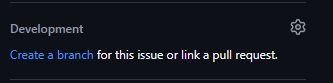
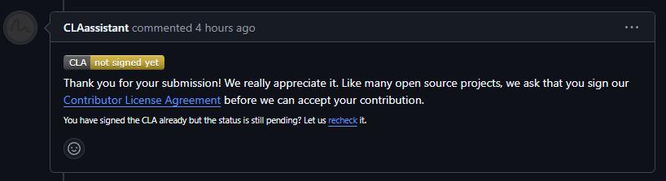
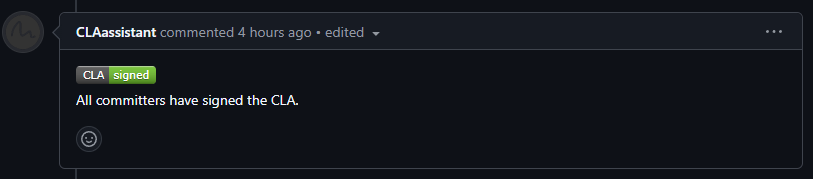

# Instructions
1. Get added to organization
1. Create a folder for the organization with `mkdir ishouldtrackthat`
1. `cd ishouldtrackthat`
1. `git clone https://github.com/ishouldtrackthat/notes`
1. `cd notes`
1. Go to the [Repository](https://github.com/ishouldtrackthat/notes/)
1. Go to [Issue](https://github.com/ishouldtrackthat/notes/issues)
1. Find your card and select `create a branch` on the right hand side under `Development` 
1. Hit the `Create branch` button
1. Run the two commands that pops up. it shoud look something like this: 
    ```sh
    git fetch origin
    git checkout <branchname>

    ## you should be working in this new branch
    ## you can run git branch to see what branch you are in
    ```
1. Create files or edit file as needed.
1. When you finish, `git add .` to add all files in the current directory, or `git add <path/to/your/file>` to add selected files
1. Commit your changes with `git commit -m "<your commit message>"`
1. `git push origin`
1. Go to the project [Pull requests](https://github.com/ishouldtrackthat/notes/pulls)
1. Find your commit and create a pull request
1. In the pull request page you would see this CLAassisstant comment if you have not signed the agreement (note: you only have to sign once when you create your first Pull Rrequest in the project):
1. Click the 'Contributor License Agreement' link and follow the instruction to sign the agreement. 
1. After you finished, you should see the updated comment indicating that you have signed the agreement
